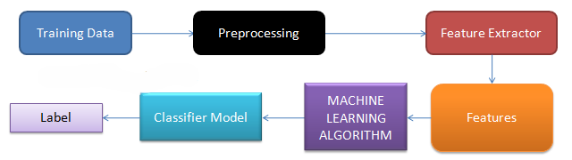

## Twitter-Sentiment-Analysis
# Problem-Statement
The objective of this task is to detect hate speech in tweets. For the sake of simplicity, we say a tweet contains hate speech if it has a racist or sexist sentiment associated with it. So, the task is to classify racist or sexist tweets from other tweets.

Formally, given a training sample of tweets and labels, where label '1' denotes the tweet is racist/sexist and label '0' denotes the tweet is not racist/sexist, your objective is to predict the labels on the test dataset.

The dataset had username of some twitter user tagged in the tweets, those tags were replaced by @users

The dataset has close to 30k labelled tweets.

I used LSTM model to classify the tweets and achieved an accuracy almost equal to 99%, isn't it great?
If you like my work, do share it among your friends as well :)
